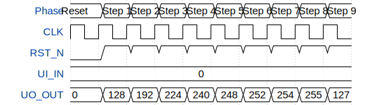

# Johnson counter

**Source:** [https://github.com/EhsanKhodadad/ttihp-wokwi](https://github.com/EhsanKhodadad/ttihp-wokwi)

**TinyTapeout Project Page:** [https://app.tinytapeout.com/projects/3663](https://app.tinytapeout.com/projects/3663)

## Input/Output Definitions

| Signal | Type | Width |
|--------|------|-------|
| CLK | clock | 1 |
| RST_N | input | 1 |
| UI_IN | input | 8 |
| UO_OUT | output | 8 |

## First 10 Cycles

| Cycle | Phase | RST_N | UI_IN | UO_OUT |
|-------|-------|-------|-------|-------|
| 0 | Reset | 0x0 | 0x0 | 0x0 |
| 1 | Step 1 | 0x1 | 0x0 | 0x80 |
| 2 | Step 2 | 0x1 | 0x0 | 0xc0 |
| 3 | Step 3 | 0x1 | 0x0 | 0xe0 |
| 4 | Step 4 | 0x1 | 0x0 | 0xf0 |
| 5 | Step 5 | 0x1 | 0x0 | 0xf8 |
| 6 | Step 6 | 0x1 | 0x0 | 0xfc |
| 7 | Step 7 | 0x1 | 0x0 | 0xfe |
| 8 | Step 8 | 0x1 | 0x0 | 0xff |
| 9 | Step 9 | 0x1 | 0x0 | 0x7f |

## Test Waveform

