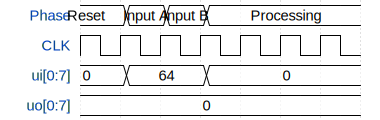

# 8Bit Posit MAC Unit

**Source:** [https://github.com/RipunjayS109/posit_mac](https://github.com/RipunjayS109/posit_mac)

**TinyTapeout Project Page:** [https://app.tinytapeout.com/projects/3667](https://app.tinytapeout.com/projects/3667)

## Input/Output Definitions

| Signal | Type | Width |
|--------|------|-------|
| CLK | clock | 1 |
| ui[0:7] | input | 8 |
| uo[0:7] | output | 8 |

## First 10 Cycles

| Cycle | Phase | ui[0:7] | uo[0:7] |
|-------|-------|-------|-------|
| 0 | Reset | 0x0 | 0x0 |
| 1 | Input A | 0x40 | 0x0 |
| 2 | Input B | 0x40 | 0x0 |
| 3 | Processing | 0x0 | 0x0 |
| 4 | Processing | 0x0 | 0x0 |
| 5 | Processing | 0x0 | 0x0 |
| 6 | Processing | 0x0 | 0x0 |

## Test Waveform

