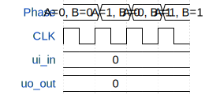

# Tiny tapeout and gate test

**Source:** [https://github.com/kessler-christopher/tt_chris_test](https://github.com/kessler-christopher/tt_chris_test)

**TinyTapeout Project Page:** [https://app.tinytapeout.com/projects/3668](https://app.tinytapeout.com/projects/3668)

## Input/Output Definitions

| Signal | Type | Width |
|--------|------|-------|
| ui_in | input | 8 |
| uo_out | output | 8 |

## First 10 Cycles

| Cycle | Phase | ui_in | uo_out |
|-------|-------|-------|-------|
| 0 | A=0, B=0 | 0x0 (FULL_A=0, FULL_B=0, XOR_1=0, XOR_2=0, AND_1=0, AND_2=0, D_FLIP=0, INV=0) | 0x0 (SUM=0, CARRY=0, XOR=0, NAND=0, AND=0, Q"=0, Q_B=0, INV_B=0) |
| 1 | A=1, B=0 | 0x0 (FULL_A=0, FULL_B=0, XOR_1=0, XOR_2=0, AND_1=0, AND_2=0, D_FLIP=0, INV=0) | 0x0 (SUM=0, CARRY=0, XOR=0, NAND=0, AND=0, Q"=0, Q_B=0, INV_B=0) |
| 2 | A=0, B=1 | 0x0 (FULL_A=0, FULL_B=0, XOR_1=0, XOR_2=0, AND_1=0, AND_2=0, D_FLIP=0, INV=0) | 0x0 (SUM=0, CARRY=0, XOR=0, NAND=0, AND=0, Q"=0, Q_B=0, INV_B=0) |
| 3 | A=1, B=1 | 0x0 (FULL_A=0, FULL_B=0, XOR_1=0, XOR_2=0, AND_1=0, AND_2=0, D_FLIP=0, INV=0) | 0x0 (SUM=0, CARRY=0, XOR=0, NAND=0, AND=0, Q"=0, Q_B=0, INV_B=0) |

## Bit Patterns

### Input (ui_in)
- **ui_in**: Input signal mappings

### Output (uo_out)
- **uo_out**: Output signal mappings

## Test Waveform

