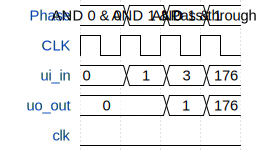

# Test (AND gate)

**Source:** [https://github.com/Biboulder/TinyTapeout-wokwi-template](https://github.com/Biboulder/TinyTapeout-wokwi-template)

**TinyTapeout Project Page:** [https://app.tinytapeout.com/projects/3671](https://app.tinytapeout.com/projects/3671)

## Input/Output Definitions

| Signal | Type | Width |
|--------|------|-------|
| ui_in | input | 8 |
| uo_out | output | 8 |
| clk | clock | 1 |

## First 10 Cycles

| Cycle | Phase | ui_in | uo_out |
|-------|-------|-------|-------|
| 0 | AND 0 & 0 | 0x0 (input a=0, input b=0) | 0x0 (output and=0) |
| 1 | AND 1 & 0 | 0x1 (input a=1, input b=0) | 0x0 (output and=0) |
| 2 | AND 1 & 1 | 0x3 (input a=1, input b=1) | 0x1 (output and=1) |
| 3 | Pass-through 4-7 | 0xb0 (input a=0, input b=0) | 0xb0 (output and=0) |

## Bit Patterns

### Input (ui_in)
- **ui_in**: Input signal mappings

### Output (uo_out)
- **uo_out**: Output signal mappings

## Test Waveform

