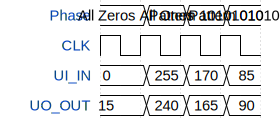

# tt3674-7seg-binary

**Source:** [https://github.com/jonbng/tinytapeout-binary-to-7segment](https://github.com/jonbng/tinytapeout-binary-to-7segment)

**TinyTapeout Project Page:** [https://app.tinytapeout.com/projects/3674](https://app.tinytapeout.com/projects/3674)

## Input/Output Definitions

| Signal | Type | Width |
|--------|------|-------|
| UI_IN | input | 8 |
| UO_OUT | output | 8 |

## Test Waveform

