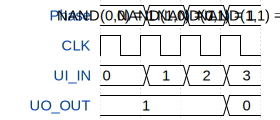

# nand_gate

**Source:** [https://github.com/exp10r3/nand_gate](https://github.com/exp10r3/nand_gate)

**TinyTapeout Project Page:** [https://app.tinytapeout.com/projects/3680](https://app.tinytapeout.com/projects/3680)

## Input/Output Definitions

| Signal | Type | Width |
|--------|------|-------|
| CLK | clock | 1 |
| UI_IN | input | 8 |
| UO_OUT | output | 8 |

## First 10 Cycles

| Cycle | Phase | UI_IN | UO_OUT |
|-------|-------|-------|-------|
| 0 | NAND(0,0) = 1 | 0x0 | 0x1 |
| 1 | NAND(1,0) = 1 | 0x1 | 0x1 |
| 2 | NAND(0,1) = 1 | 0x2 | 0x1 |
| 3 | NAND(1,1) = 0 | 0x3 | 0x0 |

## Test Waveform

