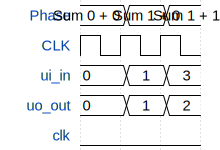

# MJ Wokwi project (Full Adder)

**Source:** [https://github.com/mjuels/tinytapeoutworkshop](https://github.com/mjuels/tinytapeoutworkshop)

**TinyTapeout Project Page:** [https://app.tinytapeout.com/projects/3681](https://app.tinytapeout.com/projects/3681)

## Input/Output Definitions

| Signal | Type | Width |
|--------|------|-------|
| ui_in | input | 8 |
| uo_out | output | 8 |
| clk | clock | 1 |

## Test Waveform

