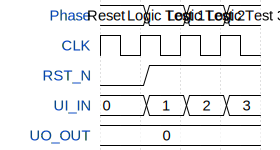

# WIP Bin to Dec (OR Logic)

**Source:** [https://github.com/SciFiCarrot/tiny-tapeout-workshop](https://github.com/SciFiCarrot/tiny-tapeout-workshop)

**TinyTapeout Project Page:** [https://app.tinytapeout.com/projects/3694](https://app.tinytapeout.com/projects/3694)

## Input/Output Definitions

| Signal | Type | Width |
|--------|------|-------|
| CLK | clock | 1 |
| RST_N | input | 1 |
| UI_IN | input | 8 |
| UO_OUT | output | 8 |

## First 10 Cycles

| Cycle | Phase | RST_N | UI_IN | UO_OUT |
|-------|-------|-------|-------|-------|
| 0 | Reset | 0x0 | 0x0 | 0x0 |
| 1 | Logic Test 1 | 0x1 | 0x1 | 0x0 |
| 2 | Logic Test 2 | 0x1 | 0x2 | 0x0 |
| 3 | Logic Test 3 | 0x1 | 0x3 | 0x0 |

## Test Waveform

