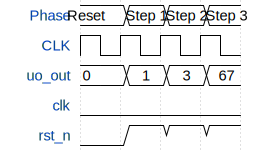

# Alex first circuit (Johnson counter)

**Source:** [https://github.com/5gyyzwxbd4-svg/First](https://github.com/5gyyzwxbd4-svg/First)

**TinyTapeout Project Page:** [https://app.tinytapeout.com/projects/3696](https://app.tinytapeout.com/projects/3696)

## Input/Output Definitions

| Signal | Type | Width |
|--------|------|-------|
| uo_out | output | 8 |
| clk | clock | 1 |
| rst_n | input | 1 |

## Bit Patterns

### Output (uo_out)
- **uo_out**: Output signal mappings

## Test Waveform

