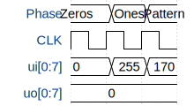

# Test Gates

**Source:** [https://github.com/AxuanW/wokwi-template](https://github.com/AxuanW/wokwi-template)

**TinyTapeout Project Page:** [https://app.tinytapeout.com/projects/3702](https://app.tinytapeout.com/projects/3702)

## Input/Output Definitions

| Signal | Type | Width |
|--------|------|-------|
| ui[0:7] | input | 8 |
| uo[0:7] | output | 8 |

## First 10 Cycles

| Cycle | Phase | ui[0:7] | uo[0:7] |
|-------|-------|-------|-------|
| 0 | Zeros | 0x0 | 0x0 |
| 1 | Ones | 0xff | 0x0 |
| 2 | Pattern | 0xaa | 0x0 |

## Test Waveform

