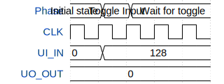

# Hello GDS

**Source:** [https://github.com/edga/tt_hello_gds](https://github.com/edga/tt_hello_gds)

**TinyTapeout Project Page:** [https://app.tinytapeout.com/projects/3704](https://app.tinytapeout.com/projects/3704)

## Input/Output Definitions

| Signal | Type | Width |
|--------|------|-------|
| UI_IN | input | 8 |
| UO_OUT | output | 8 |

## Test Waveform

