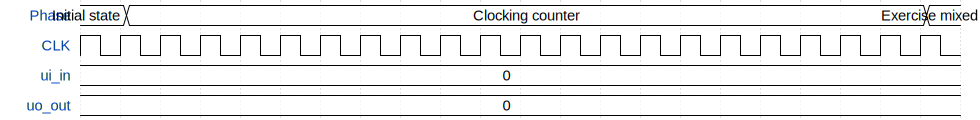

# My first design

**Source:** [https://github.com/vntinas/My_Test_design](https://github.com/vntinas/My_Test_design)

**TinyTapeout Project Page:** [https://app.tinytapeout.com/projects/3708](https://app.tinytapeout.com/projects/3708)

## Input/Output Definitions

| Signal | Type | Width |
|--------|------|-------|
| ui_in | input | 8 |
| uo_out | output | 8 |

## First 10 Cycles

| Cycle | Phase | ui_in | uo_out |
|-------|-------|-------|-------|
| 0 | Initial state | 0x0 (Data=0) | 0x0 (Data=0) |
| 1 | Clocking counter | 0x0 (Data=0) | 0x0 (Data=0) |
| 2 | Clocking counter | 0x0 (Data=0) | 0x0 (Data=0) |
| 3 | Clocking counter | 0x0 (Data=0) | 0x0 (Data=0) |
| 4 | Clocking counter | 0x0 (Data=0) | 0x0 (Data=0) |
| 5 | Clocking counter | 0x0 (Data=0) | 0x0 (Data=0) |
| 6 | Clocking counter | 0x0 (Data=0) | 0x0 (Data=0) |
| 7 | Clocking counter | 0x0 (Data=0) | 0x0 (Data=0) |
| 8 | Clocking counter | 0x0 (Data=0) | 0x0 (Data=0) |
| 9 | Clocking counter | 0x0 (Data=0) | 0x0 (Data=0) |

## Bit Patterns

### Input (ui_in)
- **ui_in**: Input signal mappings

### Output (uo_out)
- **uo_out**: Output signal mappings

## Test Waveform

