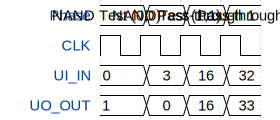

# Tiny Tapeout Workshop Test (NAND)

**Source:** [https://github.com/ds-anik/Tiny-Tapeout](https://github.com/ds-anik/Tiny-Tapeout)

**TinyTapeout Project Page:** [https://app.tinytapeout.com/projects/3711](https://app.tinytapeout.com/projects/3711)

## Input/Output Definitions

| Signal | Type | Width |
|--------|------|-------|
| ui_in | input | 8 |
| uo_out | output | 8 |

## Test Waveform

