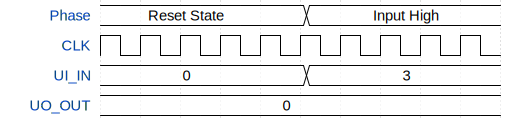

# Switch deBounce for Rotary Encoder

**Source:** [https://github.com/GustafsonA/TT26](https://github.com/GustafsonA/TT26)

**TinyTapeout Project Page:** [https://app.tinytapeout.com/projects/3715](https://app.tinytapeout.com/projects/3715)

## Input/Output Definitions

| Signal | Type | Width |
|--------|------|-------|
| CLK | clock | 1 |
| UI_IN | input | 8 |
| UO_OUT | output | 8 |

## First 10 Cycles

| Cycle | Phase | UI_IN | UO_OUT |
|-------|-------|-------|-------|
| 0 | Reset State | 0x0 | 0x0 |
| 1 | Reset State | 0x0 | 0x0 |
| 2 | Reset State | 0x0 | 0x0 |
| 3 | Reset State | 0x0 | 0x0 |
| 4 | Reset State | 0x0 | 0x0 |
| 5 | Input High | 0x3 | 0x0 |
| 6 | Input High | 0x3 | 0x0 |
| 7 | Input High | 0x3 | 0x0 |
| 8 | Input High | 0x3 | 0x0 |
| 9 | Input High | 0x3 | 0x0 |

## Test Waveform

