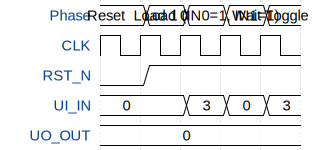

# Tiny Tapeout chip

**Source:** [https://github.com/Birkwk/Chip](https://github.com/Birkwk/Chip)

**TinyTapeout Project Page:** [https://app.tinytapeout.com/projects/3716](https://app.tinytapeout.com/projects/3716)

## Input/Output Definitions

| Signal | Type | Width |
|--------|------|-------|
| CLK | clock | 1 |
| RST_N | input | 1 |
| UI_IN | input | 8 |
| UO_OUT | output | 8 |

## Test Waveform

