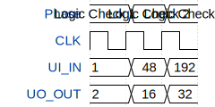

# Copenhagen Workshop Project

**Source:** [https://github.com/edwar1r/TinyTapeoutCopenhagenFeb2026](https://github.com/edwar1r/TinyTapeoutCopenhagenFeb2026)

**TinyTapeout Project Page:** [https://app.tinytapeout.com/projects/3720](https://app.tinytapeout.com/projects/3720)

## Input/Output Definitions

| Signal | Type | Width |
|--------|------|-------|
| UI_IN | input | 8 |
| UO_OUT | output | 8 |

## First 10 Cycles

| Cycle | Phase | UI_IN | UO_OUT |
|-------|-------|-------|-------|
| 0 | Logic Check 1 | 0x1 | 0x2 |
| 1 | Logic Check 2 | 0x30 | 0x10 |
| 2 | Logic Check 3 | 0xc0 | 0x20 |

## Test Waveform

