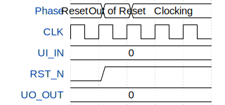

# sree

**Source:** [https://wokwi.com/projects/456578694921494529](https://wokwi.com/projects/456578694921494529)

**TinyTapeout Project Page:** [https://app.tinytapeout.com/projects/3724](https://app.tinytapeout.com/projects/3724)

## Input/Output Definitions

| Signal | Type | Width |
|--------|------|-------|
| UI_IN | input | 8 |
| CLK | input | 1 |
| RST_N | input | 1 |
| UO_OUT | output | 8 |

## Test Waveform

