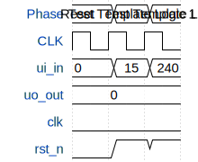

# TestWorkShop

**Source:** [https://github.com/GitteBailey/TinyTapeoutWorkshop](https://github.com/GitteBailey/TinyTapeoutWorkshop)

**TinyTapeout Project Page:** [https://app.tinytapeout.com/projects/3728](https://app.tinytapeout.com/projects/3728)

## Input/Output Definitions

| Signal | Type | Width |
|--------|------|-------|
| ui_in | input | 8 |
| uo_out | output | 8 |
| clk | clock | 1 |
| rst_n | input | 1 |

## First 10 Cycles

| Cycle | Phase | ui_in | uo_out | rst_n |
|-------|-------|-------|-------|-------|
| 0 | Reset | 0x0 (Data=0) | 0x0 (Data=0) | 0x0 |
| 1 | Test Template Logic 1 | 0xf (Data=15) | 0x0 (Data=0) | 0x1 |
| 2 | Test Template Logic 2 | 0xf0 (Data=240) | 0x0 (Data=0) | 0x1 |

## Bit Patterns

### Input (ui_in)
- **ui_in**: Input signal mappings

### Output (uo_out)
- **uo_out**: Output signal mappings

## Test Waveform

