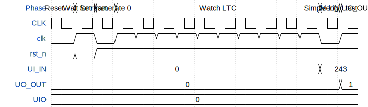

# Linear Timecode (LTC) generator

**Source:** [https://github.com/flummer/tt-um-flummer-ltc](https://github.com/flummer/tt-um-flummer-ltc)

**TinyTapeout Project Page:** [https://app.tinytapeout.com/projects/3736](https://app.tinytapeout.com/projects/3736)

## Input/Output Definitions

| Signal | Type | Width |
|--------|------|-------|
| clk | clock | 1 |
| rst_n | input | 1 |
| UI_IN | input | 8 |
| UO_OUT | output | 8 |
| UIO | inout | 8 |

## First 10 Cycles

| Cycle | Phase | rst_n | UI_IN | UO_OUT | UIO |
|-------|-------|-------|-------|-------|-------|
| 0 | Reset | 0x0 | 0x0 | 0x0 | 0x0 |
| 1 | Wait for reset | 0x0 | 0x0 | 0x0 | 0x0 |
| 2 | Set framerate 0 | 0x1 | 0x0 | 0x0 | 0x0 |
| 3 | Watch LTC | 0x1 | 0x0 | 0x0 | 0x0 |
| 4 | Watch LTC | 0x1 | 0x0 | 0x0 | 0x0 |
| 5 | Watch LTC | 0x1 | 0x0 | 0x0 | 0x0 |
| 6 | Watch LTC | 0x1 | 0x0 | 0x0 | 0x0 |
| 7 | Watch LTC | 0x1 | 0x0 | 0x0 | 0x0 |
| 8 | Watch LTC | 0x1 | 0x0 | 0x0 | 0x0 |
| 9 | Watch LTC | 0x1 | 0x0 | 0x0 | 0x0 |

## Test Waveform

