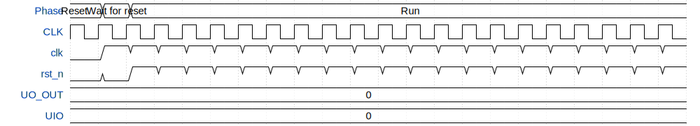

# ADPLL

**Source:** [https://github.com/chrbirks/tt-2026](https://github.com/chrbirks/tt-2026)

**TinyTapeout Project Page:** [https://app.tinytapeout.com/projects/3738](https://app.tinytapeout.com/projects/3738)

## Input/Output Definitions

| Signal | Type | Width |
|--------|------|-------|
| clk | clock | 1 |
| rst_n | input | 1 |
| UO_OUT | output | 8 |
| UIO | inout | 8 |

## Test Waveform

