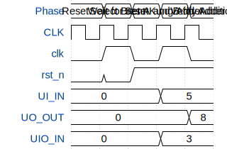

# tiny_tester

**Source:** [https://github.com/jalcim/tiny_tester](https://github.com/jalcim/tiny_tester)

**TinyTapeout Project Page:** [https://app.tinytapeout.com/projects/3740](https://app.tinytapeout.com/projects/3740)

## Input/Output Definitions

| Signal | Type | Width |
|--------|------|-------|
| clk | clock | 1 |
| rst_n | input | 1 |
| UI_IN | input | 8 |
| UO_OUT | output | 8 |
| UIO_IN | input | 8 |

## First 10 Cycles

| Cycle | Phase | rst_n | UI_IN | UO_OUT | UIO_IN |
|-------|-------|-------|-------|-------|-------|
| 0 | Reset | 0x0 | 0x0 | 0x0 | 0x0 |
| 1 | Wait for reset | 0x0 | 0x0 | 0x0 | 0x0 |
| 2 | Select Brent-Kung Adder | 0x1 | 0x0 | 0x0 | 0x0 |
| 3 | Set A and B for Adder | 0x1 | 0x5 | 0x0 | 0x3 |
| 4 | Verify Addition | 0x1 | 0x5 | 0x8 | 0x3 |

## Test Waveform

