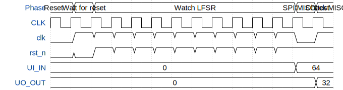

# Wedgetail TCDE REV01

**Source:** [https://github.com/SiliconPlatformsLab/wedgetail-tester-tt-ihp26a](https://github.com/SiliconPlatformsLab/wedgetail-tester-tt-ihp26a)

**TinyTapeout Project Page:** [https://app.tinytapeout.com/projects/3743](https://app.tinytapeout.com/projects/3743)

## Input/Output Definitions

| Signal | Type | Width |
|--------|------|-------|
| clk | clock | 1 |
| rst_n | input | 1 |
| UI_IN | input | 8 |
| UO_OUT | output | 8 |

## Test Waveform

