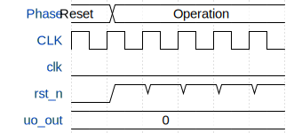

# Photo Frame

**Source:** [https://github.com/MichaelBell/ttihp26a-photo-frame](https://github.com/MichaelBell/ttihp26a-photo-frame)

**TinyTapeout Project Page:** [https://app.tinytapeout.com/projects/3756](https://app.tinytapeout.com/projects/3756)

## Input/Output Definitions

| Signal | Type | Width |
|--------|------|-------|
| clk | clock | 1 |
| rst_n | input | 1 |
| uo_out | output | 8 |

## First 10 Cycles

| Cycle | Phase | rst_n | uo_out |
|-------|-------|-------|-------|
| 0 | Reset | 0x0 | 0x0 (R[1]=0, G[1]=0, B[1]=0, vsync=0, R[0]=0, G[0]=0, B[0]=0, hsync=0) |
| 1 | Operation | 0x1 | 0x0 (R[1]=0, G[1]=0, B[1]=0, vsync=0, R[0]=0, G[0]=0, B[0]=0, hsync=0) |
| 2 | Operation | 0x1 | 0x0 (R[1]=0, G[1]=0, B[1]=0, vsync=0, R[0]=0, G[0]=0, B[0]=0, hsync=0) |
| 3 | Operation | 0x1 | 0x0 (R[1]=0, G[1]=0, B[1]=0, vsync=0, R[0]=0, G[0]=0, B[0]=0, hsync=0) |
| 4 | Operation | 0x1 | 0x0 (R[1]=0, G[1]=0, B[1]=0, vsync=0, R[0]=0, G[0]=0, B[0]=0, hsync=0) |
| 5 | Operation | 0x1 | 0x0 (R[1]=0, G[1]=0, B[1]=0, vsync=0, R[0]=0, G[0]=0, B[0]=0, hsync=0) |

## Bit Patterns

### Output (uo_out)
- **uo_out**: Output signal mappings

## Test Waveform

