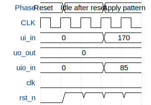

# miniMAC

**Source:** [https://github.com/YannGuidon/miniMAC_tx](https://github.com/YannGuidon/miniMAC_tx)

**TinyTapeout Project Page:** [https://app.tinytapeout.com/projects/3758](https://app.tinytapeout.com/projects/3758)

## Input/Output Definitions

| Signal | Type | Width |
|--------|------|-------|
| ui_in | input | 8 |
| uo_out | output | 8 |
| uio_in | input | 8 |
| clk | clock | 1 |
| rst_n | input | 1 |

## First 10 Cycles

| Cycle | Phase | ui_in | uo_out | uio_in | rst_n |
|-------|-------|-------|-------|-------|-------|
| 0 | Reset | 0x0 (DI0=0, DI1=0, DI2=0, DI3=0, DI4=0, DI5=0, DI6=0, DI7=0) | 0x0 (DO0=0, DO1=0, DO2=0, DO3=0, DO4=0, DO5=0, DO6=0, DO7=0) | 0x0 (D08=0, QEN=0, CLK_out=0, Zero=0, Enc=0, Dec=0, DEN=0, DI8=0) | 0x0 |
| 1 | Idle after reset | 0x0 (DI0=0, DI1=0, DI2=0, DI3=0, DI4=0, DI5=0, DI6=0, DI7=0) | 0x0 (DO0=0, DO1=0, DO2=0, DO3=0, DO4=0, DO5=0, DO6=0, DO7=0) | 0x0 (D08=0, QEN=0, CLK_out=0, Zero=0, Enc=0, Dec=0, DEN=0, DI8=0) | 0x1 |
| 2 | Idle after reset | 0x0 (DI0=0, DI1=0, DI2=0, DI3=0, DI4=0, DI5=0, DI6=0, DI7=0) | 0x0 (DO0=0, DO1=0, DO2=0, DO3=0, DO4=0, DO5=0, DO6=0, DO7=0) | 0x0 (D08=0, QEN=0, CLK_out=0, Zero=0, Enc=0, Dec=0, DEN=0, DI8=0) | 0x1 |
| 3 | Apply pattern | 0xaa (DI0=0, DI1=1, DI2=0, DI3=1, DI4=0, DI5=1, DI6=0, DI7=1) | 0x0 (DO0=0, DO1=0, DO2=0, DO3=0, DO4=0, DO5=0, DO6=0, DO7=0) | 0x55 (D08=1, QEN=0, CLK_out=1, Zero=0, Enc=1, Dec=0, DEN=1, DI8=0) | 0x1 |
| 4 | Apply pattern | 0xaa (DI0=0, DI1=1, DI2=0, DI3=1, DI4=0, DI5=1, DI6=0, DI7=1) | 0x0 (DO0=0, DO1=0, DO2=0, DO3=0, DO4=0, DO5=0, DO6=0, DO7=0) | 0x55 (D08=1, QEN=0, CLK_out=1, Zero=0, Enc=1, Dec=0, DEN=1, DI8=0) | 0x1 |

## Bit Patterns

### Input (ui_in)
- **ui_in**: Input signal mappings

### Output (uo_out)
- **uo_out**: Output signal mappings

### Bidirectional (uio_in)
- **uio_in**: Bidirectional signal mappings

## Test Waveform

