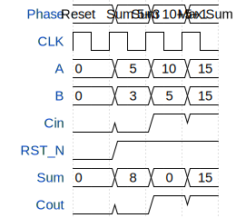

# test hard macro

**Source:** [https://github.com/jalcim/ttihp-jalcim_ihp_analog_tester](https://github.com/jalcim/ttihp-jalcim_ihp_analog_tester)

**TinyTapeout Project Page:** [https://app.tinytapeout.com/projects/3759](https://app.tinytapeout.com/projects/3759)

## Input/Output Definitions

| Signal | Type | Width |
|--------|------|-------|
| A | input | 4 |
| B | input | 4 |
| Cin | input | 1 |
| CLK | input | 1 |
| RST_N | input | 1 |
| Sum | output | 4 |
| Cout | output | 1 |

## Test Waveform

