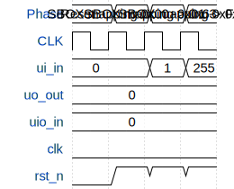

# Canright SBOX

**Source:** [https://github.com/coastalwhite/tinytapeout-ihp-canright](https://github.com/coastalwhite/tinytapeout-ihp-canright)

**TinyTapeout Project Page:** [https://app.tinytapeout.com/projects/3763](https://app.tinytapeout.com/projects/3763)

## Input/Output Definitions

| Signal | Type | Width |
|--------|------|-------|
| ui_in | input | 8 |
| uo_out | output | 8 |
| uio_in | input | 8 |
| clk | clock | 1 |
| rst_n | input | 1 |

## First 10 Cycles

| Cycle | Phase | ui_in | uo_out | uio_in | rst_n |
|-------|-------|-------|-------|-------|-------|
| 0 | Reset | 0x0 (DATA_I[0]=0, DATA_I[1]=0, DATA_I[2]=0, DATA_I[3]=0, DATA_I[4]=0, DATA_I[5]=0, DATA_I[6]=0, DATA_I[7]=0) | 0x0 (DATA_O[0]=0, DATA_O[1]=0, DATA_O[2]=0, DATA_O[3]=0, DATA_O[4]=0, DATA_O[5]=0, DATA_O[6]=0, DATA_O[7]=0) | 0x0 (STATE[0]=0, STATE[1]=0) | 0x0 |
| 1 | SBOX mapping 0x00 -> 0x63 | 0x0 (DATA_I[0]=0, DATA_I[1]=0, DATA_I[2]=0, DATA_I[3]=0, DATA_I[4]=0, DATA_I[5]=0, DATA_I[6]=0, DATA_I[7]=0) | 0x0 (DATA_O[0]=0, DATA_O[1]=0, DATA_O[2]=0, DATA_O[3]=0, DATA_O[4]=0, DATA_O[5]=0, DATA_O[6]=0, DATA_O[7]=0) | 0x0 (STATE[0]=0, STATE[1]=0) | 0x1 |
| 2 | SBOX mapping 0x01 -> 0x7c | 0x1 (DATA_I[0]=1, DATA_I[1]=0, DATA_I[2]=0, DATA_I[3]=0, DATA_I[4]=0, DATA_I[5]=0, DATA_I[6]=0, DATA_I[7]=0) | 0x0 (DATA_O[0]=0, DATA_O[1]=0, DATA_O[2]=0, DATA_O[3]=0, DATA_O[4]=0, DATA_O[5]=0, DATA_O[6]=0, DATA_O[7]=0) | 0x0 (STATE[0]=0, STATE[1]=0) | 0x1 |
| 3 | SBOX mapping 0xFF -> 0x16 | 0xff (DATA_I[0]=1, DATA_I[1]=1, DATA_I[2]=1, DATA_I[3]=1, DATA_I[4]=1, DATA_I[5]=1, DATA_I[6]=1, DATA_I[7]=1) | 0x0 (DATA_O[0]=0, DATA_O[1]=0, DATA_O[2]=0, DATA_O[3]=0, DATA_O[4]=0, DATA_O[5]=0, DATA_O[6]=0, DATA_O[7]=0) | 0x0 (STATE[0]=0, STATE[1]=0) | 0x1 |

## Bit Patterns

### Input (ui_in)
- **ui_in**: Input signal mappings

### Output (uo_out)
- **uo_out**: Output signal mappings

### Bidirectional (uio_in)
- **uio_in**: Bidirectional signal mappings

## Test Waveform

