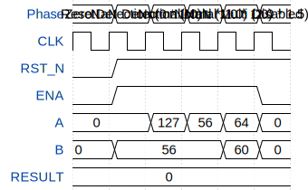

# 8-bit SEM Floating-Point Multiplier

**Source:** [https://github.com/DelosReyesJordan/ttihp26a-FP8-SEM-Multiplier](https://github.com/DelosReyesJordan/ttihp26a-FP8-SEM-Multiplier)

**TinyTapeout Project Page:** [https://app.tinytapeout.com/projects/3766](https://app.tinytapeout.com/projects/3766)

## Input/Output Definitions

| Signal | Type | Width |
|--------|------|-------|
| CLK | clock | 1 |
| RST_N | input | 1 |
| ENA | input | 1 |
| A | input | 8 |
| B | inout | 8 |
| RESULT | output | 8 |

## Test Waveform

