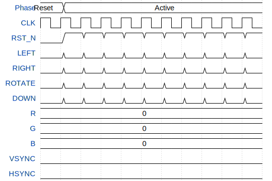

# VGA Tetris

**Source:** [https://github.com/JPGHhb/ttihp-vga-tetris](https://github.com/JPGHhb/ttihp-vga-tetris)

**TinyTapeout Project Page:** [https://app.tinytapeout.com/projects/3769](https://app.tinytapeout.com/projects/3769)

## Input/Output Definitions

| Signal | Type | Width |
|--------|------|-------|
| CLK | clock | 1 |
| RST_N | input | 1 |
| LEFT | input | 1 |
| RIGHT | input | 1 |
| ROTATE | input | 1 |
| DOWN | input | 1 |
| R | output | 2 |
| G | output | 2 |
| B | output | 2 |
| VSYNC | output | 1 |
| HSYNC | output | 1 |

## First 10 Cycles

| Cycle | Phase | RST_N | LEFT | RIGHT | ROTATE | DOWN | R | G | B | VSYNC | HSYNC |
|-------|-------|-------|-------|-------|-------|-------|-------|-------|-------|-------|-------|
| 0 | Reset | 0x0 | 0x0 | 0x0 | 0x0 | 0x0 | 0x0 | 0x0 | 0x0 | 0x0 | 0x0 |
| 1 | Active | 0x1 | 0x0 | 0x0 | 0x0 | 0x0 | 0x0 | 0x0 | 0x0 | 0x0 | 0x0 |
| 2 | Active | 0x1 | 0x0 | 0x0 | 0x0 | 0x0 | 0x0 | 0x0 | 0x0 | 0x0 | 0x0 |
| 3 | Active | 0x1 | 0x0 | 0x0 | 0x0 | 0x0 | 0x0 | 0x0 | 0x0 | 0x0 | 0x0 |
| 4 | Active | 0x1 | 0x0 | 0x0 | 0x0 | 0x0 | 0x0 | 0x0 | 0x0 | 0x0 | 0x0 |
| 5 | Active | 0x1 | 0x0 | 0x0 | 0x0 | 0x0 | 0x0 | 0x0 | 0x0 | 0x0 | 0x0 |
| 6 | Active | 0x1 | 0x0 | 0x0 | 0x0 | 0x0 | 0x0 | 0x0 | 0x0 | 0x0 | 0x0 |
| 7 | Active | 0x1 | 0x0 | 0x0 | 0x0 | 0x0 | 0x0 | 0x0 | 0x0 | 0x0 | 0x0 |
| 8 | Active | 0x1 | 0x0 | 0x0 | 0x0 | 0x0 | 0x0 | 0x0 | 0x0 | 0x0 | 0x0 |
| 9 | Active | 0x1 | 0x0 | 0x0 | 0x0 | 0x0 | 0x0 | 0x0 | 0x0 | 0x0 | 0x0 |

## Test Waveform

