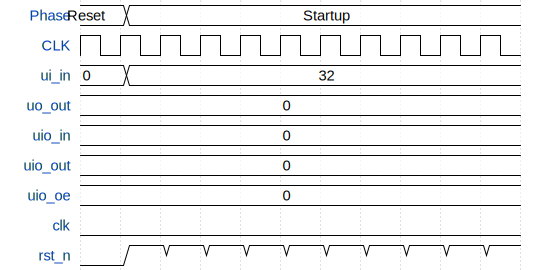

# ttihp-26a-risc-v-wg-swc1

**Source:** [https://github.com/risc-v-wg/ttihp-26a-risc-v-wg-swc1](https://github.com/risc-v-wg/ttihp-26a-risc-v-wg-swc1)

**TinyTapeout Project Page:** [https://app.tinytapeout.com/projects/3772](https://app.tinytapeout.com/projects/3772)

## Input/Output Definitions

| Signal | Type | Width |
|--------|------|-------|
| ui_in | input | 8 |
| uo_out | output | 8 |
| uio_in | input | 8 |
| uio_out | output | 8 |
| uio_oe | output | 8 |
| clk | clock | 1 |
| rst_n | input | 1 |

## First 10 Cycles

| Cycle | Phase | ui_in | uo_out | uio_in | uio_out | uio_oe | rst_n |
|-------|-------|-------|-------|-------|-------|-------|-------|
| 0 | Reset | 0x0 (rx=0, interrupt_0=0, init_qspicmd=0, init_latency[0]=0, init_latency[1]=0, init_cpu_start=0, init_uart[0]=0, init_uart[1]=0) | 0x0 (tx=0, ce_n[0]=0, ce_n[1]=0, ce_n[2]=0, sck=0, rgb_led[0]=0, rgb_led[1]=0, rgb_led[2]=0) | 0x0 (sio[0]=0, sio[1]=0, sio[2]=0, sio[3]=0, gpio[0]=0, gpio[1]=0, gpio[2]=0, gpio[3]=0) | 0x0 | 0x0 | 0x0 |
| 1 | Startup | 0x20 (rx=0, interrupt_0=0, init_qspicmd=0, init_latency[0]=0, init_latency[1]=0, init_cpu_start=1, init_uart[0]=0, init_uart[1]=0) | 0x0 (tx=0, ce_n[0]=0, ce_n[1]=0, ce_n[2]=0, sck=0, rgb_led[0]=0, rgb_led[1]=0, rgb_led[2]=0) | 0x0 (sio[0]=0, sio[1]=0, sio[2]=0, sio[3]=0, gpio[0]=0, gpio[1]=0, gpio[2]=0, gpio[3]=0) | 0x0 | 0x0 | 0x1 |
| 2 | Startup | 0x20 (rx=0, interrupt_0=0, init_qspicmd=0, init_latency[0]=0, init_latency[1]=0, init_cpu_start=1, init_uart[0]=0, init_uart[1]=0) | 0x0 (tx=0, ce_n[0]=0, ce_n[1]=0, ce_n[2]=0, sck=0, rgb_led[0]=0, rgb_led[1]=0, rgb_led[2]=0) | 0x0 (sio[0]=0, sio[1]=0, sio[2]=0, sio[3]=0, gpio[0]=0, gpio[1]=0, gpio[2]=0, gpio[3]=0) | 0x0 | 0x0 | 0x1 |
| 3 | Startup | 0x20 (rx=0, interrupt_0=0, init_qspicmd=0, init_latency[0]=0, init_latency[1]=0, init_cpu_start=1, init_uart[0]=0, init_uart[1]=0) | 0x0 (tx=0, ce_n[0]=0, ce_n[1]=0, ce_n[2]=0, sck=0, rgb_led[0]=0, rgb_led[1]=0, rgb_led[2]=0) | 0x0 (sio[0]=0, sio[1]=0, sio[2]=0, sio[3]=0, gpio[0]=0, gpio[1]=0, gpio[2]=0, gpio[3]=0) | 0x0 | 0x0 | 0x1 |
| 4 | Startup | 0x20 (rx=0, interrupt_0=0, init_qspicmd=0, init_latency[0]=0, init_latency[1]=0, init_cpu_start=1, init_uart[0]=0, init_uart[1]=0) | 0x0 (tx=0, ce_n[0]=0, ce_n[1]=0, ce_n[2]=0, sck=0, rgb_led[0]=0, rgb_led[1]=0, rgb_led[2]=0) | 0x0 (sio[0]=0, sio[1]=0, sio[2]=0, sio[3]=0, gpio[0]=0, gpio[1]=0, gpio[2]=0, gpio[3]=0) | 0x0 | 0x0 | 0x1 |
| 5 | Startup | 0x20 (rx=0, interrupt_0=0, init_qspicmd=0, init_latency[0]=0, init_latency[1]=0, init_cpu_start=1, init_uart[0]=0, init_uart[1]=0) | 0x0 (tx=0, ce_n[0]=0, ce_n[1]=0, ce_n[2]=0, sck=0, rgb_led[0]=0, rgb_led[1]=0, rgb_led[2]=0) | 0x0 (sio[0]=0, sio[1]=0, sio[2]=0, sio[3]=0, gpio[0]=0, gpio[1]=0, gpio[2]=0, gpio[3]=0) | 0x0 | 0x0 | 0x1 |
| 6 | Startup | 0x20 (rx=0, interrupt_0=0, init_qspicmd=0, init_latency[0]=0, init_latency[1]=0, init_cpu_start=1, init_uart[0]=0, init_uart[1]=0) | 0x0 (tx=0, ce_n[0]=0, ce_n[1]=0, ce_n[2]=0, sck=0, rgb_led[0]=0, rgb_led[1]=0, rgb_led[2]=0) | 0x0 (sio[0]=0, sio[1]=0, sio[2]=0, sio[3]=0, gpio[0]=0, gpio[1]=0, gpio[2]=0, gpio[3]=0) | 0x0 | 0x0 | 0x1 |
| 7 | Startup | 0x20 (rx=0, interrupt_0=0, init_qspicmd=0, init_latency[0]=0, init_latency[1]=0, init_cpu_start=1, init_uart[0]=0, init_uart[1]=0) | 0x0 (tx=0, ce_n[0]=0, ce_n[1]=0, ce_n[2]=0, sck=0, rgb_led[0]=0, rgb_led[1]=0, rgb_led[2]=0) | 0x0 (sio[0]=0, sio[1]=0, sio[2]=0, sio[3]=0, gpio[0]=0, gpio[1]=0, gpio[2]=0, gpio[3]=0) | 0x0 | 0x0 | 0x1 |
| 8 | Startup | 0x20 (rx=0, interrupt_0=0, init_qspicmd=0, init_latency[0]=0, init_latency[1]=0, init_cpu_start=1, init_uart[0]=0, init_uart[1]=0) | 0x0 (tx=0, ce_n[0]=0, ce_n[1]=0, ce_n[2]=0, sck=0, rgb_led[0]=0, rgb_led[1]=0, rgb_led[2]=0) | 0x0 (sio[0]=0, sio[1]=0, sio[2]=0, sio[3]=0, gpio[0]=0, gpio[1]=0, gpio[2]=0, gpio[3]=0) | 0x0 | 0x0 | 0x1 |
| 9 | Startup | 0x20 (rx=0, interrupt_0=0, init_qspicmd=0, init_latency[0]=0, init_latency[1]=0, init_cpu_start=1, init_uart[0]=0, init_uart[1]=0) | 0x0 (tx=0, ce_n[0]=0, ce_n[1]=0, ce_n[2]=0, sck=0, rgb_led[0]=0, rgb_led[1]=0, rgb_led[2]=0) | 0x0 (sio[0]=0, sio[1]=0, sio[2]=0, sio[3]=0, gpio[0]=0, gpio[1]=0, gpio[2]=0, gpio[3]=0) | 0x0 | 0x0 | 0x1 |

## Bit Patterns

### Input (ui_in)
- **ui_in**: Input signal mappings

### Output (uo_out)
- **uo_out**: Output signal mappings

### Bidirectional (uio_in)
- **uio_in**: Bidirectional signal mappings

## Test Waveform

