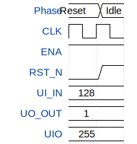

# LoRa Edge SoC

**Source:** [https://github.com/TechHU-GS/tt_rv32_trial](https://github.com/TechHU-GS/tt_rv32_trial)

**TinyTapeout Project Page:** [https://app.tinytapeout.com/projects/3775](https://app.tinytapeout.com/projects/3775)

## Input/Output Definitions

| Signal | Type | Width |
|--------|------|-------|
| ENA | input | 1 |
| RST_N | input | 1 |
| UI_IN | input | 8 |
| UO_OUT | output | 8 |
| UIO | inout | 8 |

## First 10 Cycles

| Cycle | Phase | ENA | RST_N | UI_IN | UO_OUT | UIO |
|-------|-------|-------|-------|-------|-------|-------|
| 0 | Reset | 0x1 | 0x0 | 0x80 | 0x1 | 0xff |
| 1 | Idle | 0x1 | 0x1 | 0x80 | 0x1 | 0xff |

## Test Waveform

