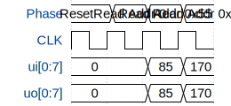

# Chip ROM

**Source:** [https://github.com/TinyTapeout/tt-chip-rom](https://github.com/TinyTapeout/tt-chip-rom)

**TinyTapeout Project Page:** [https://app.tinytapeout.com/projects/3782](https://app.tinytapeout.com/projects/3782)

## Input/Output Definitions

| Signal | Type | Width |
|--------|------|-------|
| ui[0:7] | input | 8 |
| uo[0:7] | output | 8 |

## First 10 Cycles

| Cycle | Phase | ui[0:7] | uo[0:7] |
|-------|-------|-------|-------|
| 0 | Reset | 0x0 | 0x0 |
| 1 | Read Addr 0 | 0x0 | 0x0 |
| 2 | Read Addr 0x55 | 0x55 | 0x55 |
| 3 | Read Addr 0xAA | 0xaa | 0xaa |

## Test Waveform

