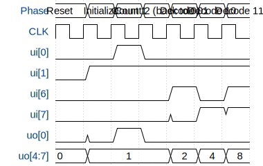

# 1-bit counter and 2-to-4 decoder

**Source:** [https://github.com/kapis20/tiny_tapeout_template](https://github.com/kapis20/tiny_tapeout_template)

**TinyTapeout Project Page:** [https://app.tinytapeout.com/projects/3802](https://app.tinytapeout.com/projects/3802)

## Input/Output Definitions

| Signal | Type | Width |
|--------|------|-------|
| ui[0] | input | 1 |
| ui[1] | input | 1 |
| ui[6] | input | 1 |
| ui[7] | input | 1 |
| uo[0] | output | 1 |
| uo[4:7] | output | 4 |

## First 10 Cycles

| Cycle | Phase | ui[0] | ui[1] | ui[6] | ui[7] | uo[0] | uo[4:7] |
|-------|-------|-------|-------|-------|-------|-------|-------|
| 0 | Reset | 0x0 | 0x0 | 0x0 | 0x0 | 0x0 | 0x0 |
| 1 | Initialize | 0x0 | 0x1 | 0x0 | 0x0 | 0x0 | 0x1 |
| 2 | Count 1 | 0x1 | 0x1 | 0x0 | 0x0 | 0x1 | 0x1 |
| 3 | Count 2 (back to 0) | 0x0 | 0x1 | 0x0 | 0x0 | 0x0 | 0x1 |
| 4 | Decode 01 | 0x0 | 0x1 | 0x1 | 0x0 | 0x0 | 0x2 |
| 5 | Decode 10 | 0x0 | 0x1 | 0x0 | 0x1 | 0x0 | 0x4 |
| 6 | Decode 11 | 0x0 | 0x1 | 0x1 | 0x1 | 0x0 | 0x8 |

## Test Waveform

