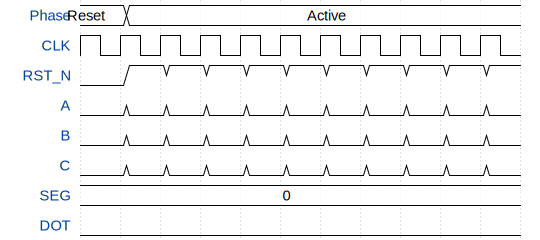

# O2ELHd 7segment display

**Source:** [https://github.com/OzelHD/wokwi_test](https://github.com/OzelHD/wokwi_test)

**TinyTapeout Project Page:** [https://app.tinytapeout.com/projects/3974](https://app.tinytapeout.com/projects/3974)

## Input/Output Definitions

| Signal | Type | Width |
|--------|------|-------|
| CLK | clock | 1 |
| RST_N | input | 1 |
| A | input | 1 |
| B | input | 1 |
| C | input | 1 |
| SEG | output | 7 |
| DOT | output | 1 |

## Test Waveform

