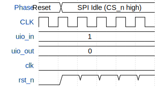

# SIMON

**Source:** [https://github.com/libormiller/ttihp-simon](https://github.com/libormiller/ttihp-simon)

**TinyTapeout Project Page:** [https://app.tinytapeout.com/projects/3978](https://app.tinytapeout.com/projects/3978)

## Input/Output Definitions

| Signal | Type | Width |
|--------|------|-------|
| uio_in | input | 8 |
| uio_out | output | 8 |
| clk | clock | 1 |
| rst_n | input | 1 |

## First 10 Cycles

| Cycle | Phase | uio_in | uio_out | rst_n |
|-------|-------|-------|-------|-------|
| 0 | Reset | 0x1 (CS_n=1, MOSI=0, MISO=0, SCK=0) | 0x0 | 0x0 |
| 1 | SPI Idle (CS_n high) | 0x1 (CS_n=1, MOSI=0, MISO=0, SCK=0) | 0x0 | 0x1 |
| 2 | SPI Idle (CS_n high) | 0x1 (CS_n=1, MOSI=0, MISO=0, SCK=0) | 0x0 | 0x1 |
| 3 | SPI Idle (CS_n high) | 0x1 (CS_n=1, MOSI=0, MISO=0, SCK=0) | 0x0 | 0x1 |
| 4 | SPI Idle (CS_n high) | 0x1 (CS_n=1, MOSI=0, MISO=0, SCK=0) | 0x0 | 0x1 |
| 5 | SPI Idle (CS_n high) | 0x1 (CS_n=1, MOSI=0, MISO=0, SCK=0) | 0x0 | 0x1 |

## Bit Patterns

### Bidirectional (uio_in)
- **uio_in**: Bidirectional signal mappings

## Test Waveform

