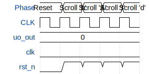

# microlane demo project

**Source:** [https://github.com/htfab/ttihp-microlane-demo](https://github.com/htfab/ttihp-microlane-demo)

**TinyTapeout Project Page:** [https://app.tinytapeout.com/projects/3988](https://app.tinytapeout.com/projects/3988)

## Input/Output Definitions

| Signal | Type | Width |
|--------|------|-------|
| uo_out | output | 8 |
| clk | clock | 1 |
| rst_n | input | 1 |

## First 10 Cycles

| Cycle | Phase | uo_out | rst_n |
|-------|-------|-------|-------|
| 0 | Reset | 0x0 (segment A=0, segment B=0, segment C=0, segment D=0, segment E=0, segment F=0, segment G=0) | 0x0 |
| 1 | Scroll 'h' | 0x0 (segment A=0, segment B=0, segment C=0, segment D=0, segment E=0, segment F=0, segment G=0) | 0x1 |
| 2 | Scroll 'A' | 0x0 (segment A=0, segment B=0, segment C=0, segment D=0, segment E=0, segment F=0, segment G=0) | 0x1 |
| 3 | Scroll 'r' | 0x0 (segment A=0, segment B=0, segment C=0, segment D=0, segment E=0, segment F=0, segment G=0) | 0x1 |
| 4 | Scroll 'd' | 0x0 (segment A=0, segment B=0, segment C=0, segment D=0, segment E=0, segment F=0, segment G=0) | 0x1 |

## Bit Patterns

### Output (uo_out)
- **uo_out**: Output signal mappings

## Test Waveform

