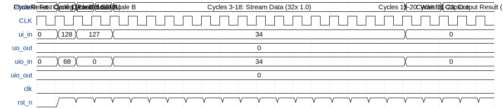

# OCP MXFP8 Streaming MAC Unit

**Source:** [https://github.com/chatelao/ttihp-fp8-mul](https://github.com/chatelao/ttihp-fp8-mul)

**TinyTapeout Project Page:** [https://app.tinytapeout.com/projects/3990](https://app.tinytapeout.com/projects/3990)

## Input/Output Definitions

| Signal | Type | Width |
|--------|------|-------|
| ui_in | input | 8 |
| uo_out | output | 8 |
| uio_in | input | 8 |
| uio_out | output | 8 |
| clk | clock | 1 |
| rst_n | input | 1 |

## First 10 Cycles

| Cycle | Phase | ui_in | uo_out | uio_in | uio_out | rst_n |
|-------|-------|-------|-------|-------|-------|-------|
| 0 | Reset | 0x0 (NBM Offset A=0, LNS Mode=0, Loopback=0, Debug=0, Short Protocol=0) | 0x0 (Result=0) | 0x0 (NBM Offset B=0, Rounding Mode=0, Overflow=0, Packed Mode=0, MX+ Enable=0) | 0x0 | 0x0 |
| 1 | Cycle 0: Fast Config (Packed E2M1) | 0x80 (NBM Offset A=0, LNS Mode=0, Loopback=0, Debug=0, Short Protocol=1) | 0x0 (Result=0) | 0x44 (NBM Offset B=4, Rounding Mode=0, Overflow=0, Packed Mode=1, MX+ Enable=0) | 0x0 | 0x1 |
| 2 | Cycle 1: Load Scale A | 0x7f (Scale=127) | 0x0 (Result=0) | 0x0 (Format=0, BM Index=0) | 0x0 | 0x1 |
| 3 | Cycle 2: Load Scale B | 0x7f (Scale=127) | 0x0 (Result=0) | 0x0 (Format=0, BM Index=0) | 0x0 | 0x1 |
| 4 | Cycles 3-18: Stream Data (32x 1.0) | 0x22 (NBM Offset A=2, LNS Mode=0, Loopback=1, Debug=0, Short Protocol=0) | 0x0 (Result=0) | 0x22 (NBM Offset B=2, Rounding Mode=0, Overflow=1, Packed Mode=0, MX+ Enable=0) | 0x0 | 0x1 |
| 5 | Cycles 3-18: Stream Data (32x 1.0) | 0x22 (NBM Offset A=2, LNS Mode=0, Loopback=1, Debug=0, Short Protocol=0) | 0x0 (Result=0) | 0x22 (NBM Offset B=2, Rounding Mode=0, Overflow=1, Packed Mode=0, MX+ Enable=0) | 0x0 | 0x1 |
| 6 | Cycles 3-18: Stream Data (32x 1.0) | 0x22 (NBM Offset A=2, LNS Mode=0, Loopback=1, Debug=0, Short Protocol=0) | 0x0 (Result=0) | 0x22 (NBM Offset B=2, Rounding Mode=0, Overflow=1, Packed Mode=0, MX+ Enable=0) | 0x0 | 0x1 |
| 7 | Cycles 3-18: Stream Data (32x 1.0) | 0x22 (NBM Offset A=2, LNS Mode=0, Loopback=1, Debug=0, Short Protocol=0) | 0x0 (Result=0) | 0x22 (NBM Offset B=2, Rounding Mode=0, Overflow=1, Packed Mode=0, MX+ Enable=0) | 0x0 | 0x1 |
| 8 | Cycles 3-18: Stream Data (32x 1.0) | 0x22 (NBM Offset A=2, LNS Mode=0, Loopback=1, Debug=0, Short Protocol=0) | 0x0 (Result=0) | 0x22 (NBM Offset B=2, Rounding Mode=0, Overflow=1, Packed Mode=0, MX+ Enable=0) | 0x0 | 0x1 |
| 9 | Cycles 3-18: Stream Data (32x 1.0) | 0x22 (NBM Offset A=2, LNS Mode=0, Loopback=1, Debug=0, Short Protocol=0) | 0x0 (Result=0) | 0x22 (NBM Offset B=2, Rounding Mode=0, Overflow=1, Packed Mode=0, MX+ Enable=0) | 0x0 | 0x1 |

## Bit Patterns

### Cycle 0: Metadata Load
- **ui_in**: Metadata 0

- **uio_in**: Metadata 1

### Cycle 1: Scale A & Config A
- **ui_in**: Scale A (8-bit Unsigned)

- **uio_in**: Config A

### Cycle 2: Scale B & Config B
- **ui_in**: Scale B (8-bit Unsigned)

- **uio_in**: Config B

### Cycles 3-34: Element Streaming
- **ui_in**: Element A_i (8-bit Float/Int)

- **uio_in**: Element B_i (8-bit Float/Int)

### Cycles 37-40: Result Output
- **uo_out**: Result Byte (serialized MSB to LSB)

## Test Waveform

