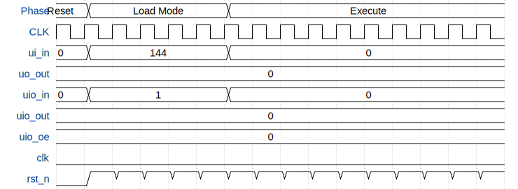

# TinyTapeout-Processor2

**Source:** [https://github.com/matei-coder/TinyTapeout-Processor2](https://github.com/matei-coder/TinyTapeout-Processor2)

**TinyTapeout Project Page:** [https://app.tinytapeout.com/projects/3991](https://app.tinytapeout.com/projects/3991)

## Input/Output Definitions

| Signal | Type | Width |
|--------|------|-------|
| ui_in | input | 8 |
| uo_out | output | 8 |
| uio_in | input | 8 |
| uio_out | output | 8 |
| uio_oe | output | 8 |
| clk | clock | 1 |
| rst_n | input | 1 |

## First 10 Cycles

| Cycle | Phase | ui_in | uo_out | uio_in | uio_out | uio_oe | rst_n |
|-------|-------|-------|-------|-------|-------|-------|-------|
| 0 | Reset | 0x0 | 0x0 | 0x0 (LOAD_MODE=0, LOAD_VALID=0) | 0x0 | 0x0 | 0x0 |
| 1 | Enter Load Mode | 0x0 | 0x0 | 0x1 (LOAD_MODE=1, LOAD_VALID=0) | 0x0 | 0x0 | 0x1 |
| 2 | Enter Load Mode | 0x0 | 0x0 | 0x1 (LOAD_MODE=1, LOAD_VALID=0) | 0x0 | 0x0 | 0x1 |
| 3 | Load LDI R0, 0x42 (0x70) | 0x70 | 0x0 | 0x3 (LOAD_MODE=1, LOAD_VALID=1) | 0x0 | 0x0 | 0x1 |
| 4 | Load LDI R0, 0x42 (0x70) Valid Low | 0x70 | 0x0 | 0x1 (LOAD_MODE=1, LOAD_VALID=0) | 0x0 | 0x0 | 0x1 |
| 5 | Load LDI R0, 0x42 (0x42) | 0x42 | 0x0 | 0x3 (LOAD_MODE=1, LOAD_VALID=1) | 0x0 | 0x0 | 0x1 |
| 6 | Load LDI R0, 0x42 (0x42) Valid Low | 0x42 | 0x0 | 0x1 (LOAD_MODE=1, LOAD_VALID=0) | 0x0 | 0x0 | 0x1 |
| 7 | Load OUT R0 (0xE0) | 0xe0 | 0x0 | 0x3 (LOAD_MODE=1, LOAD_VALID=1) | 0x0 | 0x0 | 0x1 |
| 8 | Load OUT R0 (0xE0) Valid Low | 0xe0 | 0x0 | 0x1 (LOAD_MODE=1, LOAD_VALID=0) | 0x0 | 0x0 | 0x1 |
| 9 | Load OUT R0 (0x00) | 0x0 | 0x0 | 0x3 (LOAD_MODE=1, LOAD_VALID=1) | 0x0 | 0x0 | 0x1 |

## Bit Patterns

### Load Mode Control (uio_in)
- **uio_in**: Programming Protocol Control

## Test Waveform

