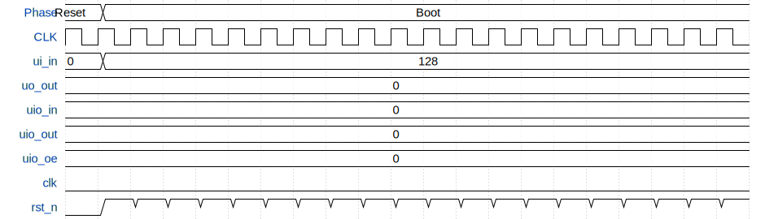

# KianV SV32 TT Linux SoC

**Source:** [https://github.com/splinedrive/kianv-sv32-tt-linux-soc](https://github.com/splinedrive/kianv-sv32-tt-linux-soc)

**TinyTapeout Project Page:** [https://app.tinytapeout.com/projects/3999](https://app.tinytapeout.com/projects/3999)

## Input/Output Definitions

| Signal | Type | Width |
|--------|------|-------|
| ui_in | input | 8 |
| uo_out | output | 8 |
| uio_in | input | 8 |
| uio_out | output | 8 |
| uio_oe | output | 8 |
| clk | clock | 1 |
| rst_n | input | 1 |

## Test Waveform

