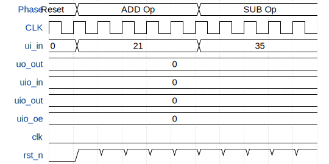

# 4-bit processor

**Source:** [https://github.com/alessio8132/IHP26a-4-bit-processor](https://github.com/alessio8132/IHP26a-4-bit-processor)

**TinyTapeout Project Page:** [https://app.tinytapeout.com/projects/4003](https://app.tinytapeout.com/projects/4003)

## Input/Output Definitions

| Signal | Type | Width |
|--------|------|-------|
| ui_in | input | 8 |
| uo_out | output | 8 |
| uio_in | input | 8 |
| uio_out | output | 8 |
| uio_oe | output | 8 |
| clk | clock | 1 |
| rst_n | input | 1 |

## First 10 Cycles

| Cycle | Phase | ui_in | uo_out | uio_in | uio_out | uio_oe | rst_n |
|-------|-------|-------|-------|-------|-------|-------|-------|
| 0 | Reset | 0x0 (operand[0]=0, operand[1]=0, operand[2]=0, operand[3]=0, opcode[0]=0, opcode[1]=0, opcode[2]=0, opcode[3]=0) | 0x0 (out_reg[0]=0, out_reg[1]=0, out_reg[2]=0, out_reg[3]=0, pc[0]=0, pc[1]=0, pc[2]=0, pc[3]=0) | 0x0 (Data=0) | 0x0 | 0x0 | 0x0 |
| 1 | ADD Op | 0x15 (operand[0]=1, operand[1]=0, operand[2]=1, operand[3]=0, opcode[0]=1, opcode[1]=0, opcode[2]=0, opcode[3]=0) | 0x0 (out_reg[0]=0, out_reg[1]=0, out_reg[2]=0, out_reg[3]=0, pc[0]=0, pc[1]=0, pc[2]=0, pc[3]=0) | 0x0 (Data=0) | 0x0 | 0x0 | 0x1 |
| 2 | ADD Op | 0x15 (operand[0]=1, operand[1]=0, operand[2]=1, operand[3]=0, opcode[0]=1, opcode[1]=0, opcode[2]=0, opcode[3]=0) | 0x0 (out_reg[0]=0, out_reg[1]=0, out_reg[2]=0, out_reg[3]=0, pc[0]=0, pc[1]=0, pc[2]=0, pc[3]=0) | 0x0 (Data=0) | 0x0 | 0x0 | 0x1 |
| 3 | ADD Op | 0x15 (operand[0]=1, operand[1]=0, operand[2]=1, operand[3]=0, opcode[0]=1, opcode[1]=0, opcode[2]=0, opcode[3]=0) | 0x0 (out_reg[0]=0, out_reg[1]=0, out_reg[2]=0, out_reg[3]=0, pc[0]=0, pc[1]=0, pc[2]=0, pc[3]=0) | 0x0 (Data=0) | 0x0 | 0x0 | 0x1 |
| 4 | ADD Op | 0x15 (operand[0]=1, operand[1]=0, operand[2]=1, operand[3]=0, opcode[0]=1, opcode[1]=0, opcode[2]=0, opcode[3]=0) | 0x0 (out_reg[0]=0, out_reg[1]=0, out_reg[2]=0, out_reg[3]=0, pc[0]=0, pc[1]=0, pc[2]=0, pc[3]=0) | 0x0 (Data=0) | 0x0 | 0x0 | 0x1 |
| 5 | ADD Op | 0x15 (operand[0]=1, operand[1]=0, operand[2]=1, operand[3]=0, opcode[0]=1, opcode[1]=0, opcode[2]=0, opcode[3]=0) | 0x0 (out_reg[0]=0, out_reg[1]=0, out_reg[2]=0, out_reg[3]=0, pc[0]=0, pc[1]=0, pc[2]=0, pc[3]=0) | 0x0 (Data=0) | 0x0 | 0x0 | 0x1 |
| 6 | SUB Op | 0x23 (operand[0]=1, operand[1]=1, operand[2]=0, operand[3]=0, opcode[0]=0, opcode[1]=1, opcode[2]=0, opcode[3]=0) | 0x0 (out_reg[0]=0, out_reg[1]=0, out_reg[2]=0, out_reg[3]=0, pc[0]=0, pc[1]=0, pc[2]=0, pc[3]=0) | 0x0 (Data=0) | 0x0 | 0x0 | 0x1 |
| 7 | SUB Op | 0x23 (operand[0]=1, operand[1]=1, operand[2]=0, operand[3]=0, opcode[0]=0, opcode[1]=1, opcode[2]=0, opcode[3]=0) | 0x0 (out_reg[0]=0, out_reg[1]=0, out_reg[2]=0, out_reg[3]=0, pc[0]=0, pc[1]=0, pc[2]=0, pc[3]=0) | 0x0 (Data=0) | 0x0 | 0x0 | 0x1 |
| 8 | SUB Op | 0x23 (operand[0]=1, operand[1]=1, operand[2]=0, operand[3]=0, opcode[0]=0, opcode[1]=1, opcode[2]=0, opcode[3]=0) | 0x0 (out_reg[0]=0, out_reg[1]=0, out_reg[2]=0, out_reg[3]=0, pc[0]=0, pc[1]=0, pc[2]=0, pc[3]=0) | 0x0 (Data=0) | 0x0 | 0x0 | 0x1 |
| 9 | SUB Op | 0x23 (operand[0]=1, operand[1]=1, operand[2]=0, operand[3]=0, opcode[0]=0, opcode[1]=1, opcode[2]=0, opcode[3]=0) | 0x0 (out_reg[0]=0, out_reg[1]=0, out_reg[2]=0, out_reg[3]=0, pc[0]=0, pc[1]=0, pc[2]=0, pc[3]=0) | 0x0 (Data=0) | 0x0 | 0x0 | 0x1 |

## Bit Patterns

### Input (ui_in)
- **ui_in**: Input signal mappings

### Output (uo_out)
- **uo_out**: Output signal mappings

### Bidirectional (uio_in)
- **uio_in**: Bidirectional signal mappings

## Test Waveform

